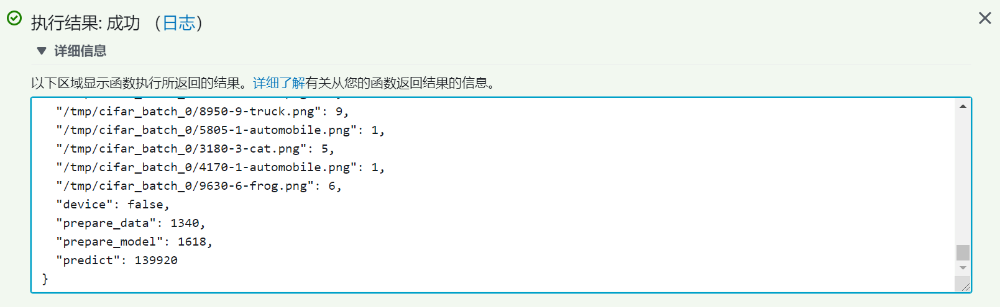
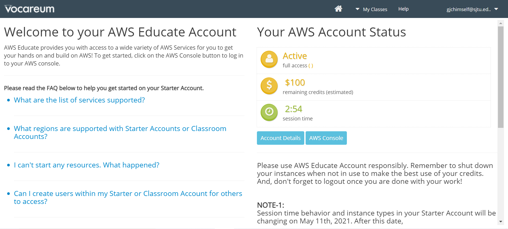
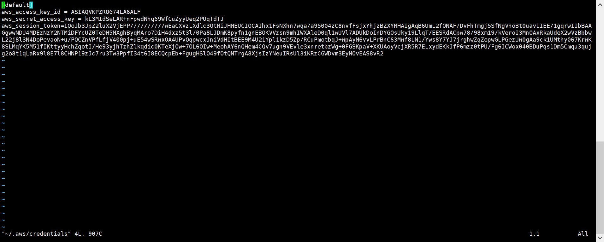
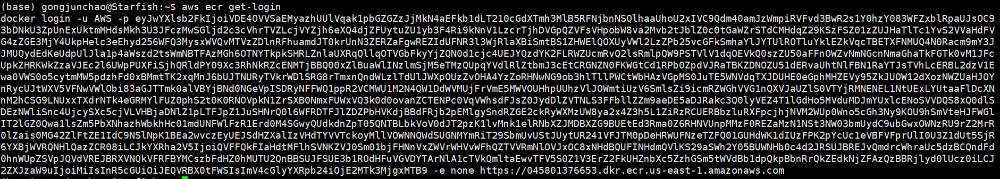
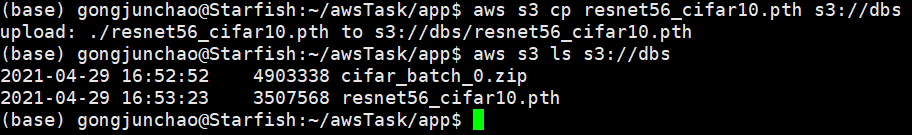
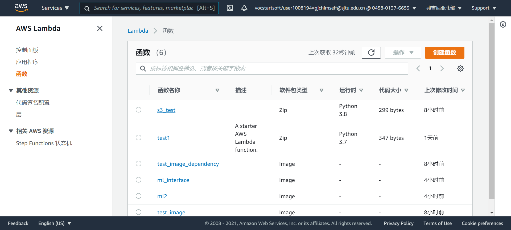
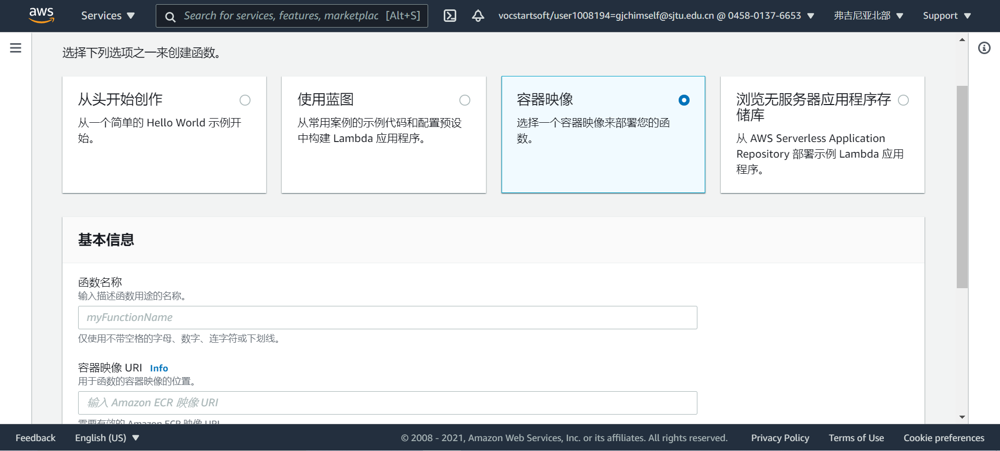
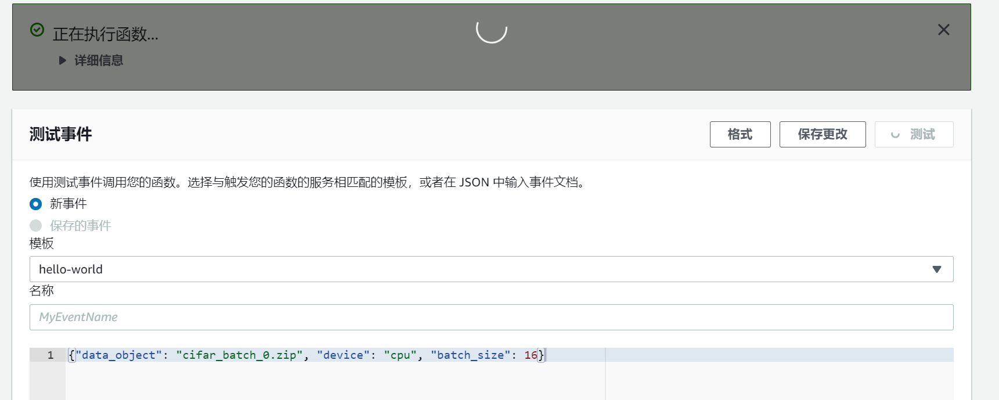

## 使用educate account 在aws lambda上部署ML INTERFACE
  

### step1 注册学生账号
> 学生账号的区域只能是us-east-1
### step2 获取用于外部访问的keys
>访问https://labs.vocareum.com/main/main.php  
>点击ACCOUNT DETAILS可获得KEYS（3H重置一次）
>
### step3 使用AWS CLI
> * 用step2得到的KEYs注册AWS CLI
> > 30022服务器，vim ~/.asw/credentials, 复制KEYs
> >
> > aws configure 设置服务区为 *us-east-1* 格式为 *json*  
> >检验是否成功：aws s3 ls
### step4 配置用于lambda函数的镜像
> 4.1 在本地创建镜像  
> > 基础镜像  
> > ``` shell
> > FROM public.ecr.aws/lambda/python:3.8
> > COPY app.py   ./
> > CMD ["app.handler"]
> > ```
> > 我配置的镜像在官方的镜像上进行了扩展见Dockerfile
> > ``` shell
> > docker build -t <ecrURI>:<tag> .
> > ```
>4.2 将镜像推送到AWS：ECR
> > ``` shell
> > #取得登录信息, 输出中-e之前为登录密钥
> > aws ecr get-login
> > #登录密钥保存到ecr_passwd中，然后
> > cat ecr_passwd | docker login --username AWS --password-stdin  account_id.dkr.ecr.us-east-1.amazonaws.com
> > #将本地的镜像Push到ecr上
> > docker push account_id.dkr.ecr.us-east-1.amazonaws.com/hello-world:<tag>
> > #列出hello-world仓库中的所有镜像
> >aws ecr  list-images --repository-name hello-world
> > ```
> > 其中account_id为https://后面的数字
> > 
### step5 将.zip和.pth推送到S3上
> 参考：*https://docs.amazonaws.cn/cli/latest/userguide/cli-services-s3-commands.html*  
> 5.1 创建bucket
> > ``` shell
> > # S3 创建一个 bucket
> > aws s3 mb s3://<bucket-name>
> > # S3 列出所有 buckets
> > aws s3 ls
> > ``` 
> 5.2 向bucket推送对象
> > ``` shell
> >aws s3 cp <LocalPath> s3://<bucket-name>
> > # S3 列出bucket中的对象
> >aws s3 ls s3://<bucket-name>
> > ```
> >
### step6 创建使用镜像的lambda函数
> lambda默认调用函数handler(event, context),可以更改
> 参考：*https://docs.aws.amazon.com/zh_cn/lambda/latest/dg/gettingstarted-awscli.html*  
*https://docs.aws.amazon.com/cli/latest/reference/lambda/create-function.html*  
> 5.1 创建函数
> > __30022中AWS CLI版本过低不支持create-function时使用image,因此用网页创建__  
> > 网页进入console中，在左上角services中进入lambda,点击创建函数
> > 
> > 使用容器映像, 左下角浏览映像从ecr中选择合适的镜像
> > 
> > ```shell
> > # 查看lambda函数
> > aws lambda list-functions
> > # 更改相关配置, 实验中内存至少500M， 时间6分钟
> > aws lambda update-function-configuration --function-name <functionName> --timeout 400 --memory-size 500 
> > ```
> 5.2 调用函数
> >``` shell
> >aws lambda invoke --function-name <functionNmae> --payload '{"data_object": "cifar_batch_0.zip", "device": "cpu", "batch_size": 16}' <ouputFile>
> >```
> >**CLI无法显示调用详细日志，用UI可以显示**
> >
### 代码介绍
1. 将minio取数据变成了从s3取数据，但注意每3个小时要更新一次app.py中keys
2. handler是默认的调用点
3. lambda镜像中，只有/tmp目录可以写入


