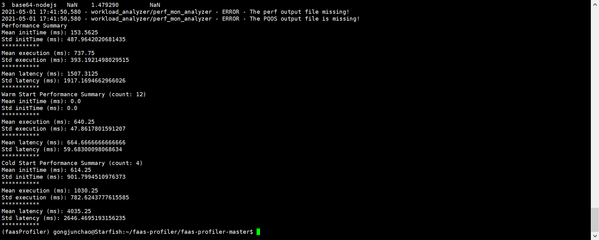

# 流程

# step0. 测试部署
## 0.1 deployment_tests测试
``` shell
#进入测试文件夹
cd tests/deployments_test
#测试wsk接口是否对齐(create和invoke)
bash run_tests.sh
```
## 0.2 unit_tests测试
``` shell
# 测试基础简化的w_invoker,w_analyzer,comparativeAnalyzer能否使用
cd tests/unit_tests
bash run_tests.sh
```
# step1. 使用 Synthetic Workload Invoker
## 1.1 配置CONFIG_FILE的参数

参数由**6个主键**组成：
* `test_name`: 配置测试的名字
* `test_duration_inseconds`: 指定测试的持续时间，例子中测试持续15s
* `random_seed`：指定随机分布的生成种子
* `blocking_cli`：设置true/false, (determines whether consecutive invocations use blocking cli calls.)
* `instances`: 需要invoke的实例的集合
* `perf_monitoring`：设置性能监控  

其中， `instances`中可以设置多个instance键值对。每个instance可以配置wsl invoke时的参数。  
单个`instance`可以配置5个键值对:
* `application`: 配置使用`wsk action list -i`可以看到的函数名
* `rate`: 有两种模式。  
第一种模式见instance2  
*使用`distribution`指定产生invokations的分布，目前支持`Uniform`和`Poisson`分布，然后用`rate`指定分布的参数，即Possion分布中的lambda*。  
第二种模式见instance3  
使用`interarrivals_list`*指定invokation的间隔。*
* `activity_window`：设置application在哪个时间段被invoked，如instance4的invoke时间段是[5,10]秒。如果不设置该选项，则默认整个`test_duration_inseconds`都被invoked。
* `param_file`：指定WSK中的-P选项，即调用的参数文件`xx.json`。
* `data_file`:(This optional entry allows specifying binary input files such as images for the function.)**目前不清楚**

`perf_monitoring`中可以设置子键值对`runtime_script`和`post_script`。

* `runtime_script`: 在test开始时启动的脚本，允许指定监视工具 such as perf, pqos, or blktrace 在test时工作。可以指定`null`忽略该选项。
* `post_script`: test结束后用于分析的脚本。可以指定`null`。

一个监视脚本的例子


## 1.2 invoke
``` shell
./WorkloadInvoker -c CONFIG_FILE
```
CONFIG_FILE(config.json)为存放参数的文件。TEST的结果可以在`logs/SWI.log`中找到。

而此次调用的信息将存放到`synthetic_workload_invoker/test_metadata.out`以供`WorkloadAnalyzer`读取

第一行为start_time(即**since**),第二行为配置文件，第三行为invoke的次数。

# step2. 使用Workload Analyzer
invoker之后将会在couchDB中增加多条函数信息  
## 2.1 在本机观察couchDB
* 查看k8s中管理的pod/couchDB  
```shell
kubectl describe pods -n openwhisk owdev-couchdb-584676b956-g5b8x
```
可以看到暴露端口是5984。

然后查看进入容器查看环境变量`COUCHDB_USER`和`COUCHDB_PASSWORD`  
```shell
kubectl exec -it -n openwhisk owdev-couchdb-584676b956-g5b8x  -- /bin/bash
``` 
查得**USER：whisk_admin**和**PASSWORD：some_passw0rd**
* 建立端口转发
```shell
# cmd
ssh -L 9999:127.0.0.1:9999 gongjunchao@202.120.32.244 -p 30022  
```
``` shell
# 30022
kubectl port-forward -n openwhisk owdev-couchdb-584676b956-g5b8x 9999:5984  
```
* 访问couchDB网页  
http://localhost:9999/_utils    
username:whisk_admin  
password:some_passw0rd    

## 2.2 ContactDB.py配置
路径为`workload_analyzer/ContactDB.py`
进行如下更改

由于原作者使用的是ansible而30022上使用的是k8s因此**url**将不同。  
10.244.1.221为容器的IP。  
body 中的配置取since以后的记录，最多limit条。参考：https://docs.couchdb.org/en/stable/api/database/find.html
## 2.3 analyze
```shell
./WorkloadAnalyzer -r
```

`logs/WA.log`可以找到调试信息。  
options:
* `-v`: 显示详细数据
* `-p`: 绘图（但是在服务器上不能plt.show(), plt.subplot()也不行，需要修改`workload_analyzer/TestDataframePlotting.py`）
* `-s`: 保存图片（必须在`-p`后使用，保存到`/results.png`）
* `-a`: 将结果存档到一个pickle文件中。(`/data_archive文件夹`)
* `-r`: 显示调用函数的返回信息。  

systemd-cgtop的监控：  
要提供cgtop信息必须在`invoker`的配置文件中设置`runtime_script`键。如果不使用监控脚本,则无法监控到CPU使用情况以及cache miss等。  
(`workload_analyzer/WorkloadAnalyzer.py`)

**作者提供的脚本似乎只能监控到30022上Cg的使用情况，无法监控到dolphin的Cg情况**  
invoker中直接在30022上启用监控脚本。(脚本所在目录`./monitoring`)  
(`workload_analyzer/WorkloadAnalyzer.py`)

以perf监控为例，它的脚本中调用命令为`sudo perf stat -a -e cpu-cycles,L1-dcache-loads,L1-dcache-load-misses,L1-icache-load-misses,dTLB-load-misses,dTLB-loads,iTLB-load-misses,iTLB-loads,branch-misses,context-switches,cpu-migrations,page-faults -I $2 -o perf-mon.out sleep $1
`
# step3. 使用Comparative Analyzer
## 3.1 compare
```shell
./ComparativeAnalyzer -p
```
options:
* `-s`: 声明一个timestamp,比较的时候只包括这个时间后的pkl文件
* `-p`: 绘图，默认的比较结果
* `-c==FILE`: 使用一个用户自定义的绘图py脚本，用户自定义的脚本必须包含在`ComparativePlotting`函数中(位于`ComparativeAnalyzer`中)。可见例子`CustomPlotting.py`。

调试信息可见`logs/CA.log`
## 3.2 代码解析
解读的代码都位于`ComparativeAnalyzer`脚本中。
* 整合pkl文件的入口。返回一个test的整合PDframe,一个perf的整合PDframe，以及一个stat的PDframe。生成这三个数据结构就意味着已经完成了比较。

**combined_test_df**

**combined_perf_df**（由于我没有在config.json中配置runtimeMonitor因此结果是None）

**combined_stat_df**(rel_stress与Throughput互为倒数)

* 以combined_test_df的生成为例  
遍历所有记录的application(configure.json中的配置)

每次遍历中生成t_df

pd.concat合并上一次的combined_test_df和这次的t_df

完成遍历后对于test_df的比较便结束。  
其余两个df的生成方式类似。
# 两个问题
1. 由于plot.show()和plt.subplot()不能在服务器上直接运行，我未能画图。
2. 作者使用的计算资源监控似乎只能针对30022无法观察到dolphin上的情况。并且由于没有性能监控软件我也没有设置runtimeMonitor。


