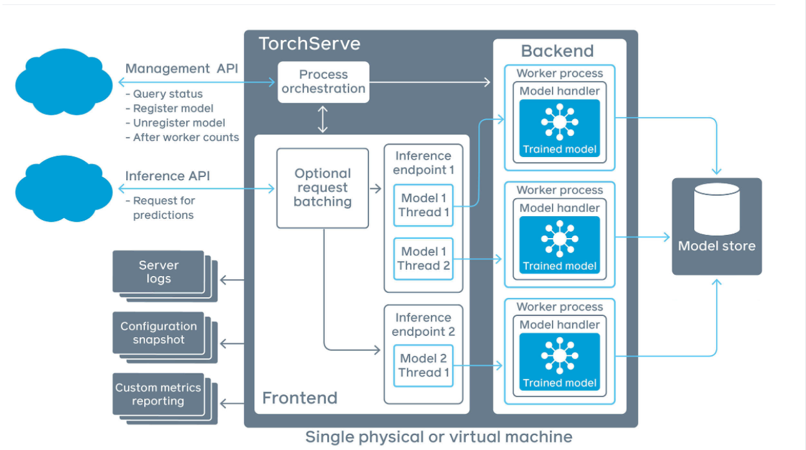
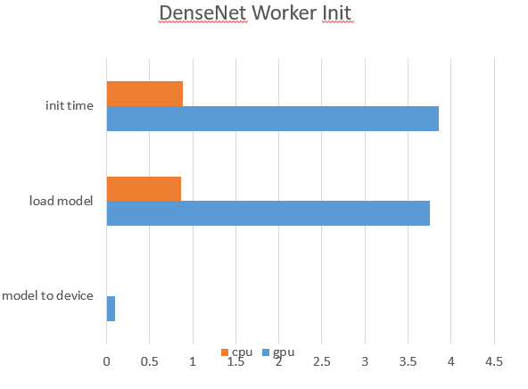
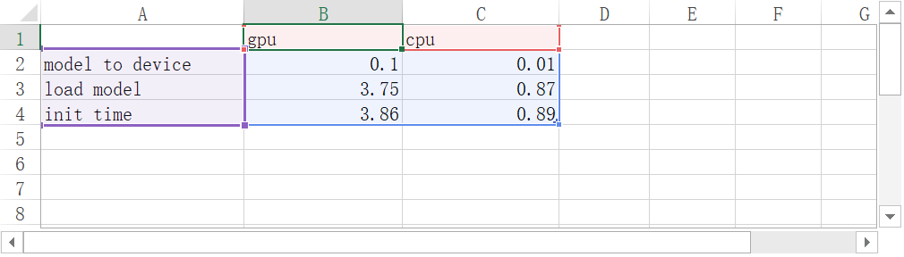
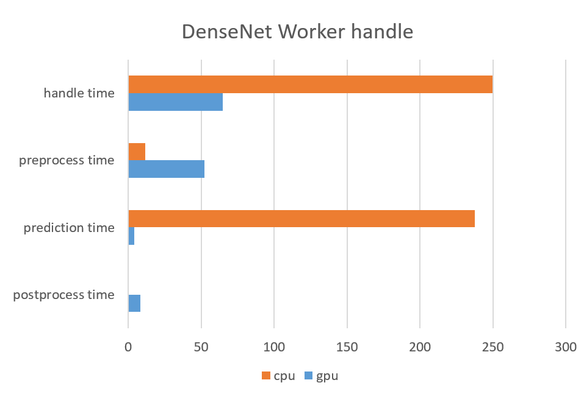
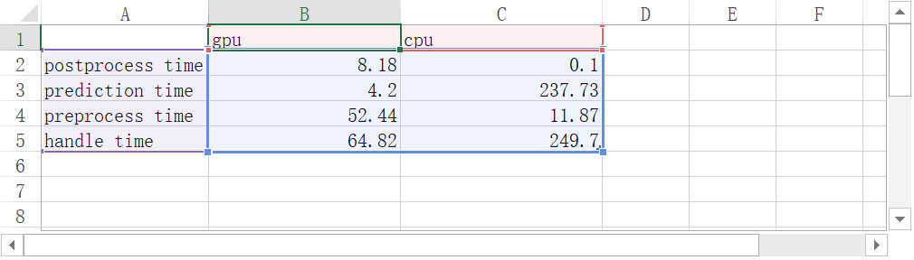
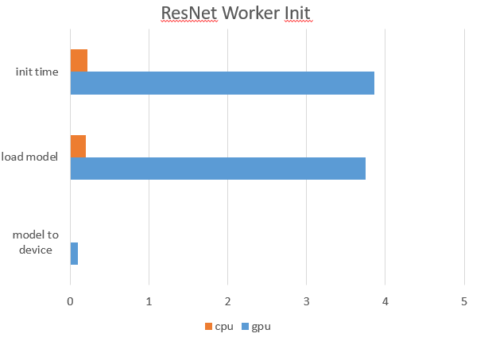
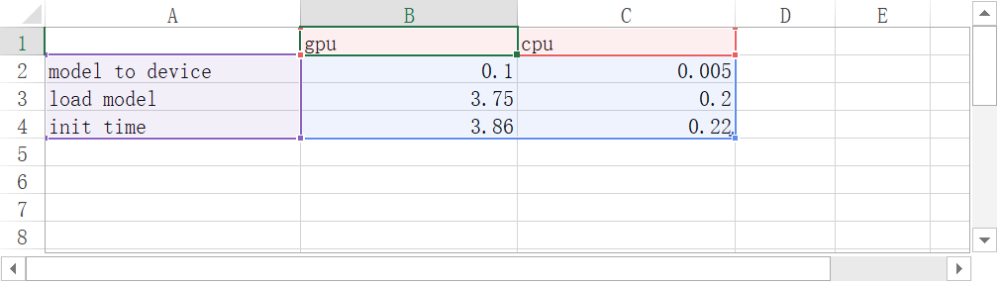
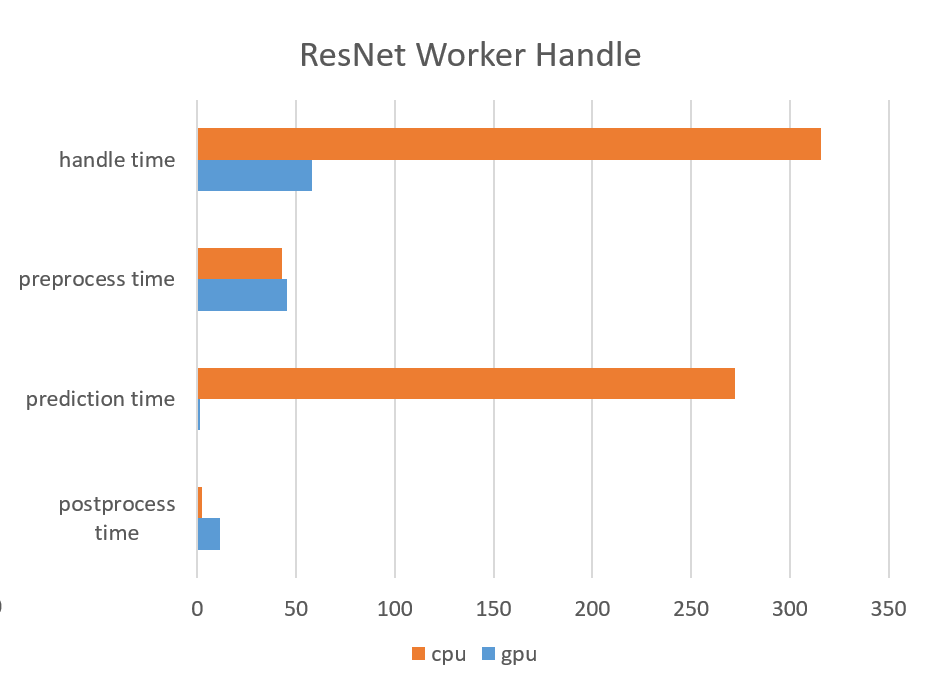
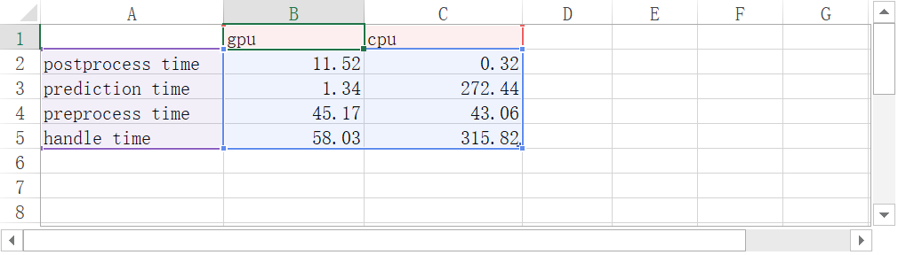

# torchserve
## 结构

### workflow
* 启动torchserve服务
* 在torchserve中注册函数(此时有了inference endpoint但缺失worker)
* 当inference收到request时，inference便会启动worker, 此后worker将一直保持，除非手动scale worker。

>worker是用来进行ML inference任务的进程。worker将根据instance的模式确定使用gpu还是cpu。management APi可以用来进行worker个数调节的。当一个model的worker数量大于硬件GPU数量时，新增的worker将会使用CPU完成任务。不同model之间会存在对GPU的竞争，官方推荐的worker配置是

`ValueToSet = (Number of Hardware GPUs) / (Number of Unique Models)`

>确定好worker的配置后，每个worker会调用handler的init用于加载模型。然后worker会一直等待。

> 当有request发生时，首先inference会收集request。当request的数量等于batchSize或者第一个request到达后经过maxBatchDelay的时间后，inference endpoint将请求中的数据转交给worker，worker从等待中唤醒，然后preprocess(data)，接着inference(data)，最后postprocess(data)将处理结果返回，然后继续等待。

## step1. 安装torchserve
参考：https://github.com/pytorch/serve

1. 安装依赖

`python ./ts_scripts/install_dependencies.py --cuda=cu102`

2. Install torchserve and torch-model-archiver

`pip install torchserve torch-model-archiver`

## step2. 测试torchserve的指标
启动torchserve服务 

`torchserve --start --ncs --model-store model_store --models densenet161.mar`

(`torchserve --stop`停止)

### 2.1 densenet161上imagenet的测试
> densenet161 X IMAGENET 是作者已经写好handler和model.py的。直接调用即可。

> * 生成.mar文件模型(其中ImaNet_densenet161_handler.py是测试用的handler)

>> `torch-model-archiver --model-name densenet161_test --version 1.0 --model-file ./serve/examples/image_classifier/densenet_161/model.py --serialized-file densenet161-8d451a50.pth --export-path model_store --extra-files ./serve/examples/image_classifier/index_to_name.json --handler /home/gongjunchao/torchServer_task/serve/ImaNet_densenet161_handler.py`

> （实验中我使用Dense_reset.sh完成注册模型）
> * 在torchserve中注册模型
>> `curl -X POST "localhost:8081/models?url=densenet161_test.mar&batch_size=16&max_batch_delay=5000&initial_workers=2"`

> * 将worker设为1(26522上只有一个可用gpu, gpuid:1)
>> `curl -v -X PUT "http://localhost:8081/models/densenet161_test?max_worker=1&min_worker=1&synchronous=true"`

> (实验中使用densenetCurl.sh模拟curl 请求，请求频率为0.1s，batchSize=16, batchDelay=3s)
> * 分别测试gpu 和 cpu的表现
>> 元命令`curl http://127.0.0.1:8080/predictions/densenet161_test -T kitten_small.jpg`

### 2.2 resnet56上cifar10的测试
> 作者没有写resnet56的框架。需要自己准备resnet56的structure, 以及resnet56的state_dict。其中structure需要是一个继承nn.module的class，在`torch-model-archiver --model-file PYpath`将sturcture.py的路径包含进去。设置custom service的详细流程可以参考这两篇文章。

>https://github.com/pytorch/serve/tree/master/examples/image_classifier/mnist

>https://github.com/pytorch/serve/blob/master/docs/custom_service.md

>注意这两个参数的说明 __--model-file__ 和 __--serialized-file__

> resnet56的结构我参考的是 https://github.com/akamaster/pytorch_resnet_cifar10/blob/master/resnet.py
> 这是一个resnet在cifar10上的网络结构。

> * 生成.mar文件模型(其中resnet56Model.py是resnet56的网络结构，re56.pth是state_dict, Cifar10_resnet56_handler.py是测试用的handler)
>> `torch-model-archiver --model-name resnet56 --version 1.0 --model-file ./serve/resnet56Model.py --serialized-file re56.pth --export-path model_store --extra-files ./serve/examples/image_classifier/index_to_name.json --handler /home/gongjunchao/torchServer_task/serve/Cifar10_resnet56_handler.py`

> （实验中我使用Res_reset.sh完成注册模型）
> * 在torchserve中注册模型
>> `curl -X POST "localhost:8081/models?url=resnet56.mar&batch_size=16&max_batch_delay=5000&initial_workers=1"`

> * 将worker设为1(26522上只有一个可用gpu, gpuid:1)
>> `curl -v -X PUT "http://localhost:8081/models/resnet56?max_worker=1&min_worker=1&synchronous=true"`

> (实验中使用resnetCurl.sh模拟curl 请求，请求频率为0.1s，batchSize=16, batchDelay=3s)
> * 分别测试gpu 和 cpu的表现
>> 元命令`curl http://127.0.0.1:8080/predictions/resnet56 -T 001-8-ship.png`

## step3. 测试结果
> 存储在data文件夹中(测试大小为2000张)

> init 时间由load model 和 model to device 组成

> handle 时间由preprocess(io.IOBYTES, 内存中的二进制转tensor) 和 prediction（model(data)） 和 postprocess（字典映射）

### 3.1 densenet161
#### init

#### handle

### 3.2 resnet56
#### init

#### handle

